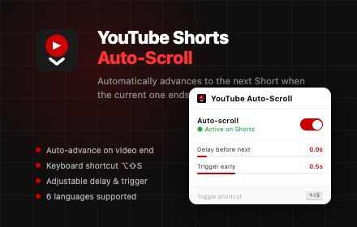
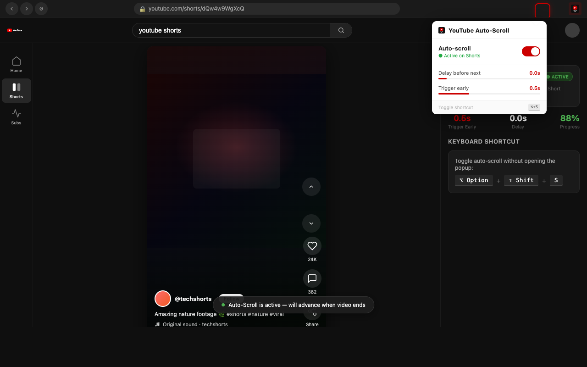
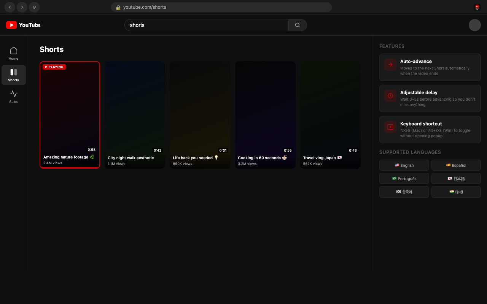

# YouTube Shorts Auto-Scroll

A Chrome extension that automatically advances to the next YouTube Short when the current video ends — so you can sit back and watch without touching a thing.



---

## What It Does

YouTube Shorts doesn't auto-advance between videos. This extension watches the current Short and navigates to the next one as soon as it finishes, with optional delay and early trigger controls.

---

## Screenshots





---

## Features

- **Auto-advance** — moves to the next Short automatically when the video ends
- **Adjustable delay** — wait 0–5 seconds before advancing so you don't miss the ending
- **Early trigger** — advance up to 2 seconds before the video finishes
- **Keyboard shortcut** — toggle on/off with `⌥⇧S` (Mac) or `Alt+Shift+S` (Windows) without opening the popup
- **6 languages** — English, Español, Português, 日本語, 한국어, हिन्दी

---

## Install from Chrome Web Store

You can install **YouTube Shorts Auto-Scroll** directly from the Chrome Web Store:

- **Chrome Web Store**: https://chromewebstore.google.com/detail/nldkgejiiicemhfkjcldnahddignnpnc?utm_source=item-share-cb

---

## Load Unpacked (Developer Mode)

1. Clone or download this repository
2. Open Chrome and go to `chrome://extensions`
3. Enable **Developer mode** (toggle in top-right)
4. Click **Load unpacked**
5. Select the `extension/` folder
6. Navigate to [youtube.com/shorts](https://www.youtube.com/shorts) — the extension is active

---

## Project Structure

```
extension/
├── manifest.json       # Extension config (MV3)
├── content.js          # Core logic — detects video end, navigates
├── background.js       # Service worker — handles keyboard shortcut
├── popup.html          # Extension popup UI
├── popup.js            # Popup logic, i18n, settings
├── icons/              # Extension icons (16, 48, 128px)
└── _locales/           # i18n strings
    ├── en/
    ├── es/
    ├── pt/
    ├── ja/
    ├── ko/
    └── hi/
docs/
└── index.html          # Privacy policy (GitHub Pages)
```

---

## How It Works

YouTube Shorts videos have the `loop` attribute set, so the standard `ended` event never fires. This extension uses `timeupdate` to detect when the video is within the trigger threshold of finishing, then clicks the native next-button or dispatches an `ArrowDown` key event to navigate.

Settings are stored locally with `chrome.storage.local` and synced to the content script on change. No data is ever collected or transmitted.

---

## Permissions

| Permission | Why |
|---|---|
| `storage` | Save your preferences locally on your device |
| `activeTab` | Send settings to the active YouTube Shorts tab |

---

## Privacy

This extension collects no data. See the full [Privacy Policy](https://nyinyiz.github.io/Youtube-autoscroll/).

---

## License

MIT
